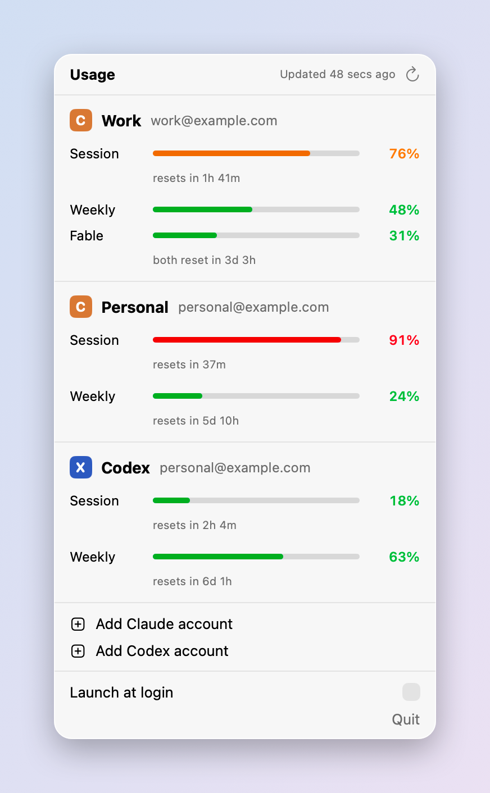

# Claude Usage — menu bar app

A tiny macOS menu bar app that shows the rate-limit usage of your AI coding
subscriptions — multiple accounts side by side:

- **Claude** (claude.ai subscription): 5-hour session limit, weekly limit,
  and model-scoped weekly limits (e.g. Fable).
- **Codex** (ChatGPT subscription): 5-hour session window, weekly window,
  and any additional named limits.

<p align="center">
  <picture>
    <source media="(prefers-color-scheme: dark)" srcset="docs/screenshot-dark.png">
    
  </picture>
</p>

## How it works

Each provider implements a small `UsageProvider` protocol (login, token
refresh, fetch limits); everything else — Keychain storage, polling, menu bar
summary, UI — is provider-agnostic.

**Claude** uses the same OAuth flow as Claude Code's `/login` (PKCE against
`claude.com/cai/oauth/authorize` with Claude Code's public client ID, token
exchange at `platform.claude.com/v1/oauth/token`, callback on
`localhost:54545/callback`). Usage comes from
`GET api.anthropic.com/api/oauth/usage` — the endpoint behind `/usage` in
Claude Code.

**Codex** uses the same OAuth flow as `codex login` (PKCE against
`auth.openai.com/oauth/authorize` with the Codex CLI's public client ID,
callback on `localhost:1455/auth/callback`). Usage comes from
`GET chatgpt.com/backend-api/wham/usage` — the endpoint behind `/status` in
the Codex CLI. Note: this backend rejects curl/scripts (bot detection) but
accepts native `URLSession` traffic, which is what the app uses.

Tokens live in your login Keychain (service `dev.erikgaal.claude-usage`, one
item per account) and are isolated from the CLIs' own logins. Only account
email/UUID/provider metadata is kept in UserDefaults.

Polling: every 5 minutes in the background, plus a refresh when the panel is
opened with data older than 2 minutes. A 429 response puts that account on a
cooldown (honoring `Retry-After`), and accounts whose sign-in expired are not
retried automatically. The ⟳ button forces a refresh of everything.

The menu bar shows one number per account: that account's most-used limit
(e.g. `21·35%`). The dropdown shows every limit with a progress bar and reset
time.

## Install (prebuilt app)

Grab `Claude-Usage-x.y.z.zip` from the
[releases page](https://github.com/erikgaal/claude-usage-menu-bar/releases),
unzip, and drag **Claude Usage.app** into `/Applications`.

The app is ad-hoc signed (not notarized), so macOS will block the first
launch. One-time fix:

1. Double-click the app (macOS shows "cannot verify" — dismiss it),
2. open **System Settings → Privacy & Security**, scroll down, and click
   **Open Anyway** next to "Claude Usage".

Or from a terminal instead: `xattr -d com.apple.quarantine "/Applications/Claude Usage.app"`.

## Notarizing (removes the Gatekeeper step)

Anyone on the paid Apple Developer Program can produce a notarized build
that installs with zero warnings. One-time setup on their machine:

1. **Developer ID Application certificate** in the login keychain. Only the
   team's Account Holder can create one: [developer.apple.com/account →
   Certificates](https://developer.apple.com/account/resources/certificates)
   → “+” → *Developer ID Application* (upload a CSR from Keychain Access).
2. **Notarytool credentials**, using an app-specific password from
   [account.apple.com](https://account.apple.com) → Sign-In and Security:

   ```sh
   xcrun notarytool store-credentials claude-usage \
     --apple-id you@example.com --team-id TEAMID --password <app-specific>
   ```

Then, from a clone of this repo:

```sh
make notarize   # signs with Developer ID, submits to Apple, staples, re-zips
```

The build automatically prefers a Developer ID identity when one is present
and signs with hardened runtime + timestamp (notarization requirements).
Verify with `spctl -a -vv "build/Claude Usage.app"` — it should print
`source=Notarized Developer ID`. The resulting zip opens on any Mac without
the "Open Anyway" step.

## Build & run from source

```sh
make run       # builds, bundles build/Claude Usage.app, and opens it
make release   # universal (arm64 + x86_64) zip in build/
make notarize  # release + Apple notarization (needs Developer ID, see above)
```

Or step by step: `make build` (swift build), `make bundle` (assemble + ad-hoc
codesign the .app), `make clean`.

Requires macOS 14+ and Xcode command line tools. No dependencies.

## Adding accounts

1. Click the gauge icon → **Add Claude Account…** or **Add Codex Account…** —
   your browser opens the provider's authorization page. Approve, and the app
   picks up the callback.
2. For a **second account on the same provider**: the browser will be logged
   into the first account, so use a private window or log out first.

If a refresh token expires the account row shows "Sign-in expired" with a
button to re-authenticate.

## Notes

- "Launch at login" uses `SMAppService` and only works when running from the
  bundled `.app` (i.e. via `make run`, not `swift run`). For it to survive
  rebuilds, consider copying `build/Claude Usage.app` to `/Applications`.
- Endpoints and OAuth constants were extracted from the Claude Code 2.1.211
  binary and the open-source `openai/codex` repo (codex-rs `login/src/server.rs`,
  `backend-client/src/client/rate_limit_resets.rs`). If a provider changes
  them, update `OAuthConfig` / `CodexConfig`.
