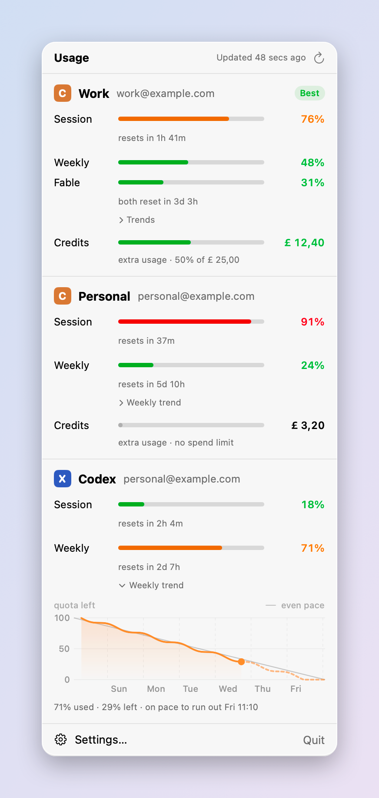

# Claude Usage — menu bar app

A tiny macOS menu bar app that shows the rate-limit usage of your AI coding
subscriptions — multiple accounts side by side:

- **Claude** (claude.ai subscription): 5-hour session limit, weekly limit,
  and model-scoped weekly limits (e.g. Fable).
- **Codex** (ChatGPT subscription): 5-hour session window, weekly window,
  and any additional named limits.

<p align="center">
  <picture>
    <source media="(prefers-color-scheme: dark)" srcset="docs/screenshot-dark.png">
    
  </picture>
</p>

## How it works

Each provider implements a small `UsageProvider` protocol (login, token
refresh, fetch limits); everything else — Keychain storage, polling, menu bar
summary, UI — is provider-agnostic.

**Claude** uses the same OAuth flow as Claude Code's `/login` (PKCE against
`claude.com/cai/oauth/authorize` with Claude Code's public client ID, token
exchange at `platform.claude.com/v1/oauth/token`, callback on
`localhost:54545/callback`). Usage comes from
`GET api.anthropic.com/api/oauth/usage` — the endpoint behind `/usage` in
Claude Code.

**Codex** uses the same OAuth flow as `codex login` (PKCE against
`auth.openai.com/oauth/authorize` with the Codex CLI's public client ID,
callback on `localhost:1455/auth/callback`). Usage comes from
`GET chatgpt.com/backend-api/wham/usage` — the endpoint behind `/status` in
the Codex CLI. Note: this backend rejects curl/scripts (bot detection) but
accepts native `URLSession` traffic, which is what the app uses.

Tokens live in your login Keychain (service `dev.erikgaal.claude-usage`, one
item per account) and are isolated from the CLIs' own logins. Only account
email/UUID/provider metadata is kept in UserDefaults.

Polling: every 5 minutes in the background, plus a refresh when the panel is
opened with data older than 2 minutes. A 429 response puts that account on a
cooldown (honoring `Retry-After`), and accounts whose sign-in expired are not
retried automatically. The ⟳ button forces a refresh of everything.

The menu bar shows one number per account: that account's most-used limit
(e.g. `21·35%`). The dropdown shows every limit with a progress bar and reset
time. Claude accounts with extra usage enabled also get a **Credits** bar
showing spend against your monthly cap (or just the amount spent, when no cap
is set).

The dropdown is a display, not a control panel: everything configurable lives
in a settings window, reachable from **Settings…** at the bottom of the
dropdown (or ⌘, while it's open). **General** holds "Launch at login" and the
notification switches — a master toggle plus one per alert (limit reaches 90%,
limit resets, sign-in expires, suggest account switches), all on by default; **Accounts** holds the
account list — add, rename, remove,
reorder (drag a row by its grip, or use the ⌃/⌄ buttons; the order is also the
menu bar's left-to-right order), and set each Claude account's quota weight.
General ends with an **About** section: version and build (selectable, for bug
reports), author, and a link to this repository.

Every multi-day window (the weekly limits) has a collapsible **burndown
chart**: quota left on the y-axis, descending across the window. A solid line
for what's been recorded, a dashed continuation for where you're heading
(flattening along the floor if it gets there before the reset — that stretch is
time you'd spend locked out), and a hairline diagonal for the pace that would
spend the window exactly, so below the line is overspending and above it is
headroom. The caption states both framings, since the bars above count the
other way: `71% used · 29% left · on pace to land at 6%`, or the time it runs
out. Charts are collapsed by default and each one remembers whether you opened
it.

The dashed projection follows **your daily rhythm** rather than a straight
line. Nobody spends quota evenly around the clock, so a single burn rate
carried across a weekly window spends it through every night too, and a chart
opened at the end of a working day reads as far more alarming than it should.
Instead, each limit learns how much it typically consumes in each hour of the
day, and the projection replays that shape — standing still through the hours
you're reliably idle, dropping through the hours you work. How *much* you're
working is fitted separately over the last two days, so the level keeps up with
a busy week while the shape stays steady. On real history this cuts a day-ahead
projection's error by about a third, and the caption's run-out time lands in
working hours instead of at 4am. Windows without enough history yet, and the
five-hour session windows (too short to hold a day/night shape), keep the
single fitted rate.

Every poll's per-limit percents are appended to a local history file (one JSON
file per account under Application Support, 14 days of 5-minute samples), which
is where the trend charts and projections come from. The learned daily shape
lives in a separate few-hundred-byte file per account, so it can keep
accumulating after the raw samples are pruned. Nothing leaves your machine; a
fresh install has a line to draw within minutes, a projection once three polls
span half an hour, and a daily rhythm once it has watched a couple of days.

## Install (prebuilt app)

Grab `Claude-Usage-x.y.z.zip` from the
[releases page](https://github.com/erikgaal/claude-usage-menu-bar/releases),
unzip, and drag **Claude Usage.app** into `/Applications`.

The app is ad-hoc signed (not notarized), so macOS will block the first
launch. One-time fix:

1. Double-click the app (macOS shows "cannot verify" — dismiss it),
2. open **System Settings → Privacy & Security**, scroll down, and click
   **Open Anyway** next to "Claude Usage".

Or from a terminal instead: `xattr -d com.apple.quarantine "/Applications/Claude Usage.app"`.

## Notarizing (removes the Gatekeeper step)

Anyone on the paid Apple Developer Program can produce a notarized build
that installs with zero warnings. One-time setup on their machine:

1. **Developer ID Application certificate** in the login keychain. Only the
   team's Account Holder can create one: [developer.apple.com/account →
   Certificates](https://developer.apple.com/account/resources/certificates)
   → “+” → *Developer ID Application* (upload a CSR from Keychain Access).
2. **Notarytool credentials**, using an app-specific password from
   [account.apple.com](https://account.apple.com) → Sign-In and Security:

   ```sh
   xcrun notarytool store-credentials claude-usage \
     --apple-id you@example.com --team-id TEAMID --password <app-specific>
   ```

Then, from a clone of this repo:

```sh
make notarize   # signs with Developer ID, submits to Apple, staples, re-zips
```

The build automatically prefers a Developer ID identity when one is present
and signs with hardened runtime + timestamp (notarization requirements).
Verify with `spctl -a -vv "build/Claude Usage.app"` — it should print
`source=Notarized Developer ID`. The resulting zip opens on any Mac without
the "Open Anyway" step.

## Build & run from source

```sh
make run          # builds, bundles build/Claude Usage.app, and opens it
make release      # universal (arm64 + x86_64) zip in build/
make notarize     # release + Apple notarization (needs Developer ID, see above)
make screenshots  # regenerate docs/screenshot-{light,dark}.png from mock data
```

Or step by step: `make build` (swift build), `make bundle` (assemble + ad-hoc
codesign the .app), `make clean`.

Requires macOS 14+ and Xcode command line tools. No dependencies.

## Adding accounts

1. Click the gauge icon → **Settings…** → **Accounts** → **Add Claude account**
   or **Add Codex account** — your browser opens the provider's authorization
   page. Approve, and the app picks up the callback.
2. For a **second account on the same provider**: the browser will be logged
   into the first account, so use a private window or log out first.

If a refresh token expires the account row in the dropdown shows "Sign-in
expired" with a button to re-authenticate.

## Notes

- "Launch at login" uses `SMAppService` and only works when running from the
  bundled `.app` (i.e. via `make run`, not `swift run`). For it to survive
  rebuilds, consider copying `build/Claude Usage.app` to `/Applications`.
- Endpoints and OAuth constants were extracted from the Claude Code 2.1.211
  binary and the open-source `openai/codex` repo (codex-rs `login/src/server.rs`,
  `backend-client/src/client/rate_limit_resets.rs`). If a provider changes
  them, update `OAuthConfig` / `CodexConfig`.
